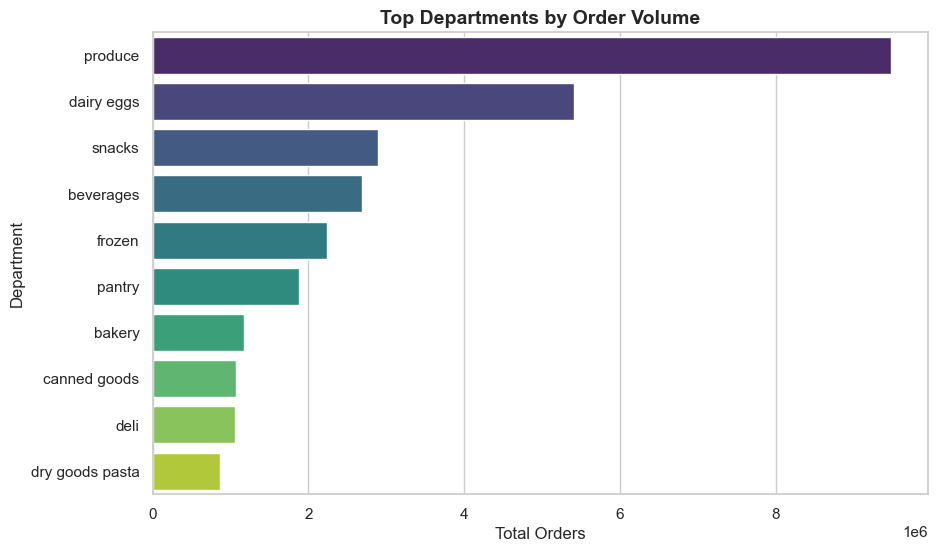

# BUSINESS QUESTIONS  

---

## 1. Which departments drive the most orders? 

**Insight**  
* Produce dominates overall demand with a massive lead over all other departments  
* Dairy & Eggs also show strong recurring demand indicating essential category behavior  

**Decision**  
* Prioritize inventory, forecasting, and supply chain for top departments  
* Strengthen cross-selling strategies within high-performing categories  
* Optimize SKU count by reducing focus on low-performing departments  

---  

## 2. Which aisles generate the highest customer traffic?  

**Insight**  
* Fresh fruits and vegetables aisles attract the highest customer traffic  
* Daily essentials like yogurt, milk, and bread consistently drive repeat visits  

**Decision**  
* Place high-traffic aisles in strategic store locations to maximize flow  
* Use these aisles for cross-selling and promotional placements  
* Apply loss-leader pricing to attract and retain customers  

---  

## 3. What are the most in-demand products?  

**Insight**  
* Demand is highly concentrated around a few products like bananas and organic items  
* Customer preference strongly leans toward healthy and organic choices  

**Decision**  
* Ensure high availability and zero stock-outs for top-selling products  
* Use top products in recommendation engines and bundling strategies  
* Expand organic product offerings to match customer preference  

---  

## 4. How does order volume vary by day of the week?  

**Insight**  
* Order volume peaks on Sunday and remains high on Monday  
* Mid-week demand drops significantly, with Thursday being the lowest  

**Decision**  
* Increase staffing and logistics capacity during weekends  
* Run promotions and discounts on low-demand weekdays  
* Align inventory replenishment with weekly demand cycles  

---  

## 5. What are peak ordering hours?  

**Insight**  
* Most orders are placed between 10 AM and 3 PM  
* Customer activity drops significantly during evening and night hours  

**Decision**  
* Optimize delivery slots and infrastructure during peak hours  
* Run targeted ads and notifications during high-activity periods  
* Reduce operational load during low-demand hours  

---  

## 6. How are customers segmented based on behavior?  

**Insight**  
* Regular customers form the largest segment of users  
* Frequent users are smaller in number but contribute high value  
* Occasional users are less engaged but still significant  

**Decision**  
* Focus on retention strategies rather than just acquisition  
* Introduce loyalty programs for frequent users  
* Launch reactivation campaigns for occasional users  

---  

## 7. How does customer type affect basket size?  

**Insight**  
* Occasional users tend to have larger basket sizes compared to frequent users  
* Frequent users prefer smaller, quick purchases indicating convenience-driven behavior  

**Decision**  
* Offer bulk discounts and combo deals to occasional users  
* Provide fast checkout and subscription options for frequent users  
* Personalize offers based on purchasing behavior  

---  

## 8. Which departments have the highest reorder rates?  

**Insight**  
* Dairy, beverages, and produce have the highest reorder rates  
* These categories represent habitual and necessity-driven purchases  

**Decision**  
* Introduce subscription and auto-reorder features for these categories  
* Promote “Buy Again” recommendations prominently  
* Ensure consistent stock availability to avoid customer churn  

---  

## 9. Does cart position impact reorder behavior?  

**Insight**  
* Products added early in the cart have significantly higher reorder probability  
* Reorder likelihood decreases steadily with later cart positions  

**Decision**  
* Display recommended and high-value products at the top of the cart  
* Optimize cart ranking algorithms for better conversions  
* Promote high-margin products early in the user journey  

---  

## 10. Are popular products always highly reordered?  

**Insight**  
* High popularity does not always translate to high reorder rates  
* Some niche products show strong customer loyalty despite lower demand  

**Decision**  
* Separate strategies for high-demand and high-loyalty products  
* Ensure visibility and availability of high-demand products  
* Promote and retain loyal product segments through targeted campaigns  

---